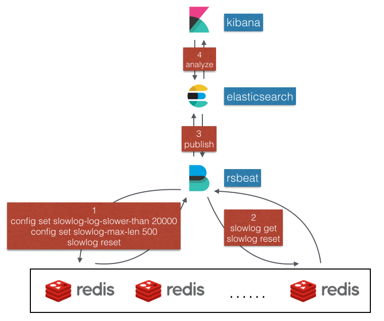

Name
====
rsbeat - The Beat used to collect and analyze redis slow log.


Table of Contents
=================
* [Name](#name)
* [Status](#status)
* [Version](#version)
* [Requirements](#requirements)
* [Description](#description)
* [Usage](#usage)
    * [Install](#install)
    * [Config](#config)
    * [Run](#run)
    * [Docker](#docker)
* [Exported Fields](#exported-fields)
* [Author](#author)

Status
======

Production ready.

Version
=======

The current version is 5.3.2.

Requirements
============
* [Golang](https://golang.org/dl/) 1.7
* ElasticStack 5.x

Description
===========
Rsbeat use `slowlog get` command to read slow log. The following image shows the key flow.



1. Rsbeat connects to every redis server and send the following commands.
```shell
config set slowlog-log-slower-than 20000 # tell redis to log all commands whose execution time exceeds this time in microseconds
config set slowlog-max-len 500 # tell redis to just record recent 500 slow logs
slowlog reset #tell redis to clear current slow log records
```
2. Rsbeat periodically pull slow log from redis.
3. Rsbeat publish all slow log events to elasticsearch.
4. User can analyze all slow log events through Kibana. Rsbeat has already provided the useful kibana dashboard which user can import directly to kibana.

Usage
=====

Like the other beats, rsbeat is easy to use.

Install
=======
To build the binary for rsbeat run the command below. This will generate a binary in the same directory with the name rsbeat.

```bash
make
```

Alternatively, you can download the binary file from [release page](https://github.com/Yourdream/rsbeat/releases).

To run rsbeat with debugging output enabled, run:

```
./rsbeat -c rsbeat.yml -e -d "*"
```

Config
======
Rsbeat has the following config fields.

```yaml
rsbeat:
  period: 1s 
  redis: ["192.168.33.10:6379"]
  slowerThan: 100 
```
* rsbeat.period: Defines how often an event is sent to the output.
* rsbeat.redis: Defines redis server list.
* rsbeat.slowerThan: Defines time in microseconds which is sent to redis server by command `config set slowlog-log-slower-than`.

Run
===
Firstly, run rsbeat.

```
./rsbeat -c rsbeat.yml
```

Secondly, import kibana dashboard.

Enjoy your travel to redis slow log now!

Exported Fields
=====
Following is the exported fields.

```json
{
    "@timestamp": "2017-04-24T04:51:59.000Z",
    "slowId": 717,
    "cmd": "SADD",
    "key": "pushUserId",
    "args": [
      "dfd60b06de3b102afcdcad12sad"
    ],
    "duration": 928,
    "ipPort": "127.0.0.1:6379",
    "extraTime": "2017-04-24T04:51:59Z",
    "beat": {
      "hostname": "localhost",
      "name": "localhost",
      "version": "5.1.3"
    },
    "type": "rsbeat"
  }
```

Compare to redis `slowlog get` output fields:

```
redis 127.0.0.1:6379> slowlog get
1)  1) (integer) 717
    2) (integer) 1493009519
    3) (integer) 928
    4) 1) "SADD"
       2) "pushUserId"
       3) "dfd60b06de3b102afcdcad12sad"

```

Every entry is composed of four fields coresponding to rsbeat exported fields:
* `slowId`: A unique progressive identifier for every slow log entry.
* `extraTime`: The unix timestamp at which the logged command was processed.
* `duration`: The amount of time needed for its execution, in microseconds.
* `cmd` `key` `args`: The array composing the arguments of the command.

Author
======
* [Lau](https://github.com/liugaohua)
* [Leon J](https://github.com/jyj1993126)
* [Rockybean](https://github.com/rockybean)
